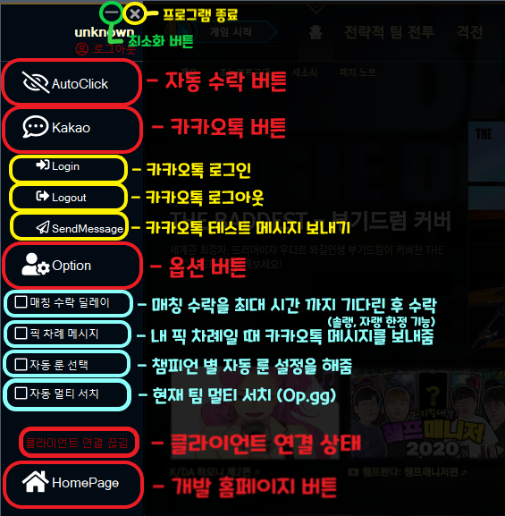

# AutoBot_OpenSource

KakaoAPI, Riot LCU API, Web 크롤링등을 활용한 리그오브레전드 유틸리티 프로그램입니다.

## 주요 기능 한눈에 보기

자세한 코드 정보는 블로그에 포스팅 했습니다.

- [개발과정 포스팅 #0 - 목차]
  https://jaeho0613.tistory.com/167

- [개발과정 포스팅 #1 - API (Kakao C#)]
  https://jaeho0613.tistory.com/168

- [개발과정 포스팅 #2 - API (Riot LCU C#)]
  https://jaeho0613.tistory.com/169

- [개발과정 포스팅 #3 - Process, UI, FontAsome]
  https://jaeho0613.tistory.com/170

- [개발과정 포스팅 #4 - Web 크롤링]
  https://jaeho0613.tistory.com/171

## AutoBot2_Folder

: Visual Studio로 제작 된 Winform 프로젝트입니다.

## ExampleProject_Folder

: AutoBot 주요 기능을 프로젝트 형식으로 구현했습니다.
